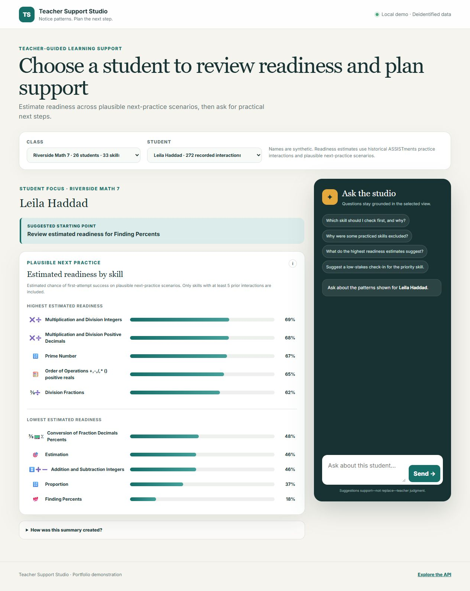
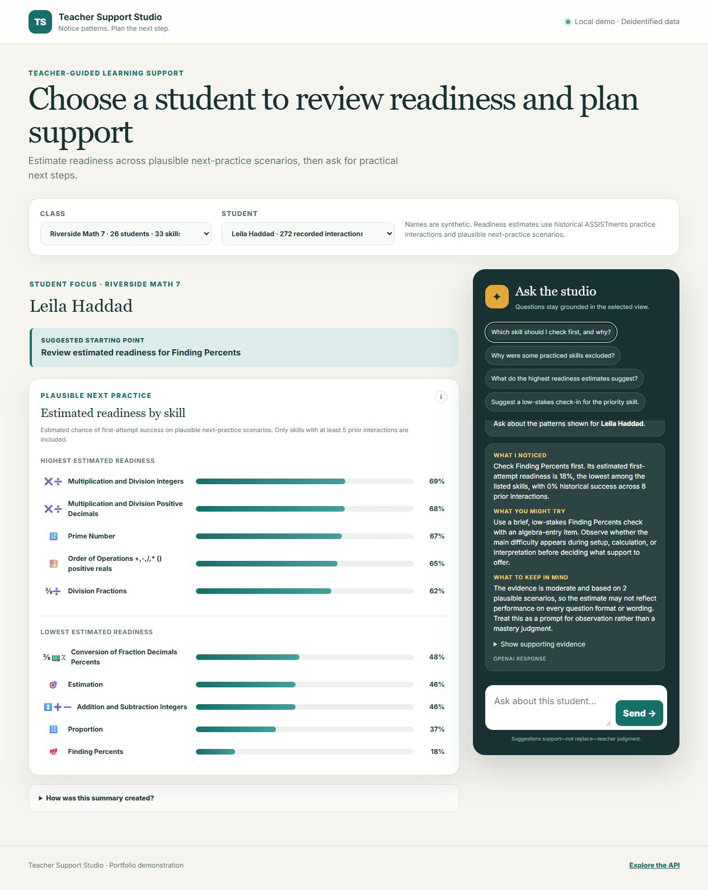
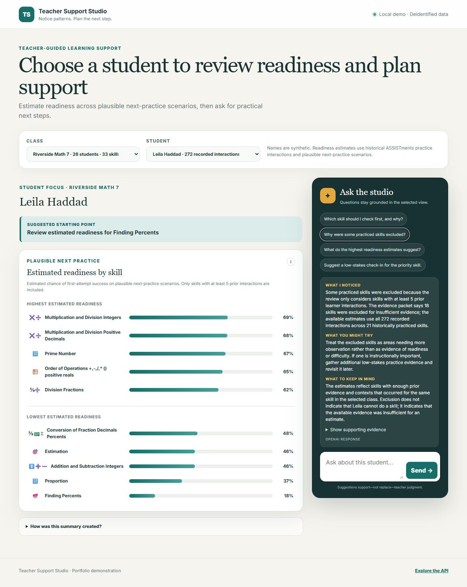

# Student Proficiency Prediction & AI Teacher Assistant

An end-to-end educational data science project that uses longitudinal
ASSISTments practice data to predict a student's probability of first-attempt
success on upcoming skill practice.

The project compares an interpretable logistic regression baseline with
XGBoost, evaluates probability quality and calibration, and uses model-native
SHAP contributions to explain individual XGBoost predictions. The longer-term
goal is to feed student- and class-level analytics into a grounded teacher
assistant that translates structured evidence into teacher-friendly language.

## Project goals

- Engineer leakage-safe features using only information available before each
  predicted interaction.
- Compare predictive performance, calibration, interpretability, and practical
  intervention thresholds.
- Produce student-skill proficiency profiles and class-level analytics.
- Build a teacher-facing dashboard and evidence-grounded AI assistant.
- Keep educators responsible for instructional decisions and document the
  system's limitations and intended use.

## Data

The project uses the
[ASSISTments 2009–2010 Skill Builder dataset](https://sites.google.com/site/assistmentsdata/home/2009-2010-assistment-data/skill-builder-data-2009-2010).
Raw and processed CSV datasets are versioned with Git LFS. The repository also
includes project-specific data dictionaries under `data/data_dictionary/`.

After filtering to original problems with a valid skill identifier, the
modeling dataset contains 259,386 interactions from 4,163 students. First-attempt
correctness is 65.8%; the median student has 19 interactions, while the median
student-skill history contains five interactions.

## Latest findings

The current evaluation uses a global chronological split by `order_id`: the
earliest 70% of unique order identifiers for training, the next 15% for
validation, and the latest 15% for testing. All longitudinal predictors are
shifted so that a prediction for interaction `t` uses only information available
before `t`.

| Model | Test ROC-AUC | Test average precision | Test log loss | Test Brier score | Balanced accuracy at validation-selected threshold |
| --- | ---: | ---: | ---: | ---: | ---: |
| Logistic regression | 0.6746 | 0.8251 | 0.5565 | 0.1864 | 0.6121 at 0.590 |
| XGBoost | **0.7000** | **0.8454** | **0.5443** | **0.1823** | **0.6317 at 0.635** |
| Development-prevalence baseline | 0.5000 | 0.7169 | 0.6068 | 0.2078 | 0.5000 |

Key results:

- XGBoost provides a modest but consistent improvement over logistic regression
  on discrimination and probability-error metrics.
- Recent student-skill performance is the strongest nonlinear signal. XGBoost's
  leading gain feature is mean skill accuracy over the prior five relevant
  interactions; student prior accuracy, skill practice history, recent skill
  accuracy, streaks, and historical help seeking are also influential in SHAP
  explanations.
- The validation-selected XGBoost threshold favors a more even tradeoff between
  recognizing correct and incorrect outcomes than the default 0.50 threshold.
  It is an experimental operating point, not a validated educational cutoff.
- Results show temporal and population shift: training, validation, and test
  correctness rates are 65.6%, 60.9%, and 71.7%, respectively, and the final
  test window contains 38,909 interactions but only 87 students. The test result
  therefore should not be treated as evidence of broad student generalization.

## Current status

Completed work includes data-quality analysis, educational EDA, leakage-safe
longitudinal feature engineering, chronological dataset exports, an
L2-regularized logistic regression baseline, and a tuned XGBoost comparison with
global and local explanations. Both models use the same 170 documented
predictors and held-out evaluation protocol.

Next steps are subgroup and temporal-stability audits, student-clustered
uncertainty intervals, probability recalibration if needed, and an evaluation
split designed explicitly for unseen-student generalization. A functioning
local teacher-support application and persisted deployment artifacts are now
available; production monitoring remains future work.

## Teacher Support Studio

The repository includes a locally runnable first draft of **Teacher Support
Studio**, a FastAPI application that lets a teacher select a student, review
estimated readiness across named skills, and ask contextual questions. For each
skill, the app reconstructs the learner's state from all prior interactions,
creates up to ten next-practice contexts that actually occurred in the
selected class, and batch-scores them with the XGBoost artifact exported by
notebook 05. The display uses synthetic names over authentic deidentified class
groupings. The logistic-regression artifact remains available as a
deployment-ready benchmark but is not used by the app.

The readiness view deliberately excludes skills with fewer than five prior
learner interactions. It then displays the five highest and five lowest median
XGBoost estimates among skills with sufficient evidence. This threshold is a
portfolio-demo evidence rule, not a validated educational cutoff. The estimates
support low-stakes teacher review and are not mastery classifications.



### Prediction and guidance workflow

1. The teacher selects a synthetic class and student name mapped to authentic
   deidentified identifiers.
2. The application retrieves the student's complete recorded interaction
   history, including activity outside the currently selected class.
3. For each named skill, it constructs up to ten historically observed question
   contexts using supported answer formats and problem metadata.
4. The persisted XGBoost model scores all scenarios in one batch. The median
   probability becomes the skill's estimated readiness.
5. Skills with fewer than five learner interactions are excluded before the top
   and bottom readiness groups are selected.
6. A LangGraph workflow sends only the selected metrics and supporting evidence
   to OpenAI for a structured, teacher-friendly response. If OpenAI is
   unavailable, the same endpoint returns a deterministic local response.

### Grounded teacher assistant

The question panel includes preloaded prompts aligned with the selected student
view. Responses are constrained to the supplied readiness evidence and use
three predictable sections: what the model suggests, a low-stakes action the
teacher might try, and limitations to keep in mind. The examples below were
captured from live OpenAI responses; wording can vary between runs.

**Preloaded question: “Which skill should I check first, and why?”**



**Preloaded question: “Why were some practiced skills excluded?”**



### Editable demo mappings

Synthetic display names are mapped to real deidentified `class_id` and
`student_id` values in
`outputs/teacher_support_studio/teacher_support_name_mapping.xlsx`. Edit a name
or the `include_in_demo` setting, save the workbook, and refresh the app. The
mapping is reloaded automatically after the saved file changes.

Skill emoji bullets are similarly controlled by
`outputs/teacher_support_studio/skill_emoji_mapping.xlsx`. Edit an emoji while
keeping its skill name unchanged, save the workbook, and refresh the app. The
FastAPI mapping endpoint reloads the saved workbook automatically.

### Run locally

Without an OpenAI API key, the app returns deterministic guided responses so
the full experience remains usable. With `OPENAI_API_KEY` configured, a
LangGraph workflow uses OpenAI to generate a structured response grounded in
the displayed evidence.

```powershell
uv sync
uv run uvicorn teacher_support_studio.main:app --app-dir src --reload
```

Then open `http://127.0.0.1:8000`. Interactive API documentation is available
at `http://127.0.0.1:8000/docs`. To enable live OpenAI responses, copy
`.env_example` to `.env`, add a scoped API key, and load those environment
variables before starting the server.

Notebook 04 exports its complete preprocessing and logistic-regression pipeline
to `models/logistic_regression/`. Notebook 05 exports the portable native model
and serving metadata used by the app to `models/xgboost/`. Re-executing either
notebook refreshes its corresponding bundle.

## Reproduce the analysis

Install the environment from `pyproject.toml` and `uv.lock`, then run the
notebooks in order:

1. `01_data_quality_and_filtering.ipynb`
2. `02_eda_learning_patterns.ipynb`
3. `03_feature_engineering.ipynb`
4. `04_logistic_regression_baseline.ipynb`
5. `05_xgboost_model.ipynb`

## Responsible use

This project is a demonstration of teacher-facing decision support. Its outputs
are not measures of intelligence, general ability, motivation, disability, or
psychological mastery, and should not automatically determine grading,
placement, or interventions.
