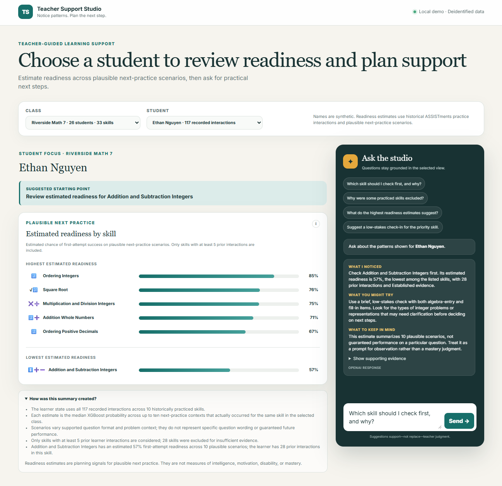

# Student Proficiency Prediction & AI Teacher Assistant

End-to-end educational machine learning project that predicts a student's probability of first-attempt success on upcoming skill practice and turns those estimates into teacher-facing, evidence-grounded guidance.

The project combines leakage-safe longitudinal feature engineering, interpretable and nonlinear classification models, SHAP explanations, and a deployable FastAPI application called **Teacher Support Studio**.

> Core focus: Educational data science, probability estimation, explainable machine learning, responsible AI, and teacher-facing application engineering.



---

## Project Highlights

- **Task:** Binary classification of first-attempt correctness on the next student-skill interaction
- **Data:** 259,386 filtered interactions from 4,163 students in the ASSISTments 2009–2010 Skill Builder dataset
- **Features:** 170 documented predictors constructed only from information available before each prediction
- **Models:** L2-regularized logistic regression and tuned XGBoost
- **Best test ROC-AUC:** 0.7000 with XGBoost
- **Explainability:** Global feature importance and model-native local SHAP contributions
- **Application:** FastAPI teacher dashboard with student-skill readiness estimates and a LangGraph-powered assistant
- **Responsible-use design:** Evidence minimums, deidentified data, explicit uncertainty language, and human decision-making retained by educators

---

## Motivation and Problem Statement

Student practice histories contain signals about recent performance, prior opportunities, help seeking, and skill-specific learning patterns. Used carefully, those signals can help a teacher decide where a low-stakes check-in may be useful.

The machine learning objective is to estimate:

> What is the probability that a student answers the next skill-practice interaction correctly on the first attempt?

The application objective is to present that evidence in language that supports teacher review without turning a model score into a mastery label, placement decision, or automated intervention.

---

## Dataset Description

This project uses the [ASSISTments 2009–2010 Skill Builder dataset](https://sites.google.com/site/assistmentsdata/home/2009-2010-assistment-data/skill-builder-data-2009-2010). Raw and processed CSV files are tracked with Git LFS, and project-specific data dictionaries are stored under `data/data_dictionary/`.

After filtering to original problems with a valid skill identifier, the modeling dataset contains:

| Dataset characteristic | Value |
| --- | ---: |
| Interactions | 259,386 |
| Students | 4,163 |
| First-attempt correctness | 65.8% |
| Median interactions per student | 19 |
| Median interactions per student-skill history | 5 |

### Leakage Controls

The prediction row for interaction `t` uses only information available before `t`:

- Longitudinal student and skill features are shifted before modeling.
- Train, validation, and test sets follow a global chronological split by `order_id`.
- Model thresholds are selected on validation data, not the test set.
- Logistic regression and XGBoost use the same 170 predictors and held-out evaluation protocol.
- The test window is reserved for final evaluation after model development.

---

## Modeling Workflow

The workflow is organized into five notebooks:

1. `01_data_quality_and_filtering.ipynb` — validate, document, and filter the source data
2. `02_eda_learning_patterns.ipynb` — examine student, skill, practice, and help-seeking patterns
3. `03_feature_engineering.ipynb` — generate leakage-safe longitudinal predictors and chronological exports
4. `04_logistic_regression_baseline.ipynb` — train the interpretable baseline and export its full preprocessing pipeline
5. `05_xgboost_model.ipynb` — tune and evaluate XGBoost, generate explanations, and export the serving artifact

### Time-Aware Evaluation Split

Unique `order_id` values are divided chronologically:

| Split | Chronological share | Observed correctness | Purpose |
| --- | ---: | ---: | --- |
| Train | Earliest 70% | 65.6% | Fit model parameters |
| Validation | Next 15% | 60.9% | Select model settings and operating threshold |
| Test | Latest 15% | 71.7% | Final held-out evaluation |

The changing outcome rates make temporal and population shift an important part of interpreting the final scores.

---

## Model Results

| Model | Test ROC-AUC | Test average precision | Test log loss | Test Brier score | Balanced accuracy |
| --- | ---: | ---: | ---: | ---: | ---: |
| Logistic regression | 0.6746 | 0.8251 | 0.5565 | 0.1864 | 0.6121 at 0.590 |
| **XGBoost** | **0.7000** | **0.8454** | **0.5443** | **0.1823** | **0.6317 at 0.635** |
| Development-prevalence baseline | 0.5000 | 0.7169 | 0.6068 | 0.2078 | 0.5000 |

### Key Findings

- XGBoost provides a modest but consistent improvement over logistic regression on discrimination and probability-error metrics.
- Recent student-skill performance is the strongest nonlinear signal. The leading XGBoost gain feature is mean skill accuracy over the prior five relevant interactions.
- Student prior accuracy, skill practice history, recent skill accuracy, streaks, and historical help seeking also contribute to predictions and SHAP explanations.
- The validation-selected XGBoost threshold produces a more balanced tradeoff between recognizing correct and incorrect outcomes than the default 0.50 threshold.
- The final test window contains 38,909 interactions but only 87 students, so the results should not be interpreted as broad evidence of unseen-student generalization.

The selected threshold is an experimental operating point, not a validated educational cutoff.

---

## Teacher Support Studio

Teacher Support Studio is a locally runnable FastAPI application that lets a teacher select a synthetic class and student, review estimated readiness across named skills, and ask questions grounded in the displayed evidence.

For each skill, the application reconstructs the student's state from all prior interactions, creates up to ten plausible next-practice contexts that occurred in the selected class, and batch-scores those scenarios with the persisted XGBoost model.

### Readiness Workflow

1. The teacher selects a synthetic class and student name mapped to authentic deidentified identifiers.
2. The application retrieves the student's complete recorded interaction history.
3. It constructs up to ten historically observed question contexts for each named skill.
4. The persisted XGBoost model scores the scenarios, and their median probability becomes the skill's estimated readiness.
5. Skills with fewer than five prior learner interactions are excluded before the five highest and five lowest readiness estimates are selected.
6. A LangGraph workflow gives OpenAI only the selected metrics and supporting evidence for a structured response. If OpenAI is unavailable, the endpoint returns deterministic local guidance.


### Grounded Teacher Assistant

The assistant answers preloaded or free-form questions using three predictable sections: what the model suggests, a low-stakes action the teacher might try, and limitations to keep in mind.

**Example: identifying the first skill to review**


**Example: explaining the evidence threshold**


### Editable Demo Mappings

Synthetic display names are mapped to deidentified `class_id` and `student_id` values in `outputs/teacher_support_studio/teacher_support_name_mapping.xlsx`. Update a name or its `include_in_demo` setting, save the workbook, and refresh the app.

Skill emoji bullets are controlled by `outputs/teacher_support_studio/skill_emoji_mapping.xlsx`. Both workbooks are reloaded automatically after a saved file changes.

---

## Application Architecture

```text
ASSISTments history
        |
        v
Leakage-safe learner state + historically observed next-practice contexts
        |
        v
Persisted XGBoost model ---> Skill readiness summaries
                                      |
                                      v
                         Teacher Support Studio UI
                                      |
                          +-----------+-----------+
                          |                       |
                          v                       v
              Deterministic guidance     LangGraph + OpenAI
```

The OpenAI path is optional. Readiness scoring and deterministic teacher guidance remain available without an API key.

---

## Technologies

- **Data and modeling:** Python 3.13, pandas, NumPy, SciPy, scikit-learn, XGBoost
- **Interpretability and visualization:** XGBoost model-native SHAP contributions, Plotly, Kaleido
- **Application:** FastAPI, Uvicorn, Pydantic, JavaScript, HTML, CSS
- **Generative AI:** LangGraph, LangChain, OpenAI
- **Reproducibility and quality:** uv, JupyterLab, pytest, Ruff, Git LFS
- **Deployment:** Render Blueprint with a self-contained reviewer bundle

---

## Repository Structure

```text
.
├── data/                       # Raw, processed, and data-dictionary assets
├── deployment/render/          # Self-contained Render deployment bundle
├── docs/images/                # Application screenshots
├── graphics/                   # Portfolio overview graphics
├── models/                     # Persisted logistic regression and XGBoost artifacts
├── notebooks/                  # Ordered analysis and modeling workflow
├── outputs/                    # Editable Teacher Support Studio mappings
├── scripts/                    # Deployment-bundle and notebook export utilities
├── src/teacher_support_studio/ # FastAPI app, analytics, model, and assistant logic
├── tests/                      # Analytics and application tests
├── .env_example                # Optional local OpenAI configuration template
├── pyproject.toml              # Project metadata and dependencies
├── uv.lock                     # Reproducible dependency lockfile
└── README.md
```

---

## How to Run Locally

### 1. Clone the repository and pull Git LFS assets

```powershell
git lfs install
git clone https://github.com/helsharif/teacher-support-studio.git
cd teacher-support-studio
git lfs pull
```

### 2. Install the environment

```powershell
uv sync
```

### 3. Configure optional OpenAI responses

The complete application works without an OpenAI API key by using deterministic guided responses. To enable live grounded responses:

```powershell
Copy-Item .env_example .env
```

Add a scoped `OPENAI_API_KEY` to `.env`. Never commit the populated `.env` file.

### 4. Start Teacher Support Studio

```powershell
uv run uvicorn teacher_support_studio.main:app --app-dir src --reload
```

Open `http://127.0.0.1:8000`. Interactive API documentation is available at `http://127.0.0.1:8000/docs`.

### 5. Run tests and lint checks

```powershell
uv run pytest
uv run ruff check .
```

---

## Reproduce the Analysis

After installing the environment and pulling the Git LFS data, run the notebooks in numerical order:

```text
notebooks/01_data_quality_and_filtering.ipynb
notebooks/02_eda_learning_patterns.ipynb
notebooks/03_feature_engineering.ipynb
notebooks/04_logistic_regression_baseline.ipynb
notebooks/05_xgboost_model.ipynb
```

Notebook 04 refreshes the complete logistic-regression preprocessing and model bundle under `models/logistic_regression/`. Notebook 05 refreshes the native XGBoost serving artifact and metadata under `models/xgboost/`.

To rebuild the self-contained Render bundle after changing the application, model, mappings, or demo selection:

```powershell
uv run python scripts/build_render_bundle.py
```

See `deployment/render/README.md` for the Render Blueprint setup.

---

## Current Status and Roadmap

Completed work includes data-quality analysis, educational EDA, leakage-safe feature engineering, chronological dataset exports, model comparison, XGBoost explanations, persisted serving artifacts, automated tests, and a working teacher-support application.

Planned extensions:

- Subgroup and temporal-stability audits
- Student-clustered uncertainty intervals
- Probability recalibration if diagnostics show it is needed
- Evaluation designed specifically for unseen-student generalization
- Production monitoring and expanded application observability

---

## Responsible Use and Limitations

This project is a portfolio demonstration of teacher-facing decision support. Its outputs are planning signals for plausible next practice, not measures of intelligence, general ability, motivation, disability, or psychological mastery.

- Do not use predictions to automatically determine grading, placement, access, or interventions.
- Treat the five-interaction minimum as a portfolio-demo evidence rule, not a validated educational standard.
- Interpret results in light of the temporal and population shift in the held-out data.
- Validate model behavior, calibration, subgroup performance, and instructional impact before any real educational use.
- Keep educators responsible for contextual interpretation and final decisions.

---

## Author

**Husayn El Sharif** — Senior Data Scientist / Machine Learning Engineer
